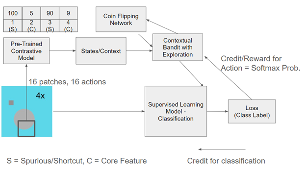

# Contextual Bandits with Pseudocounts based Exploration for Mitigating Shortcut Learning
Features used by ANNs often differ from humans, they prefer more available features (pixel footprint) even if they are less or similarly predictive as the core ones. The project uses exploration &amp; bandits to guide a supervised learning algo to attend to the core features instead of the spurious ones.

# Proposed Architecture: 

# Limitations and Challenges: 
1. Data: The synthetic image data is very difficult to get "right". It has to follow 2 conditions to be a good dataset. The first is that it has to be easy enough and only rely on the sampled z_s and z_c for an image to belong to a particular class such that we can compare the image model with a Bayes optimal classifier trained on the raw embedded z values. While being simple enough, it has to be also complex enough in such a way that the model actually needs to use the values of z_s and z_c to make its classification decision. This is done by making the square and the circle objects greyscale in the original work, but this is not at all a trivial operation. In the work done till now, I tried to make the scales and range of z_s and z_c different for each class but keeping the objects as greyscale never resulted in above-chance accuracy for a vanilla ResNet18-based supervised model. I still need to figure out how to do this, i.e., how to even reproduce the existing literature. I ended up making class 0 and class 1 have different colors, red and green but this resulted in the model ignoring the intensity of the colors and only relying on the type of the color for classification.
2. The bandit neural network stops learning after around 5 epochs. Are the contexts generated by the contrastive learning model varied enough to distinguish states? If so, does the bandit need more model complexity to simply take an input embedding of size 258 and tell us whether to include it or not? Maybe the embedding size is too small? These are all questions that need more time to investigate.

# Experimental Results: 
Results can be found on this weights and biases project: https://wandb.ai/vipul/RL_Project_CSCI2951F 
# Notes: 
1. Bias is averaged across 5 runs of the models (so total 10 runs since model and optimal classifier)

I'm not using bounding boxes or IOU as the truth values unlike past RL Computer Vision work. 
For every application, there's some ground truth for localization/segmentation/tracking present. 
I don't have any ground truth, "hope" that exploration will work out is all I have. 

Human feedback in other papers which tune vision models using RL.

Foveation counter ->
It's essentially a RL guided cropping in the image space. A much more complicated dropout. 
But does this lead to any "meaningful" features in the deep neural network which correspond to a class's core concepts? 
Not explicitly set up for this. 

Bootstrapping problem: Seed? Where to start foveation process from?
GradCAM as a solution but GradCAM unreliable. 

Possible reward hacking/shortcut:
* just do a crop such that all of image is included. When to stop expanding crop window??
* just always crop the background and never the foreground if background is higly correlated. Back to square one/problem.
Class labels are not enough, need some "meaning"/feature attributes to be compared.
Uses some threshold of probability matching with true label as "good enough" of a match.

Harmonization/Alignment emerging without any exlicit reward/feedback for it.

	
1. generate dataset for all iamges -> Done. Two types of data generated, stick with oen of them. 
2. contrastive learning model to generate feature states -> done
3. supervised learning model baseline with an alpha ration of 4 and predictivity as 0.9 (baseline). -> done, all settings with 5 seeds data available now. 
4. coding for measures of reliance and bias -> done

5. bandit algos made -> done
6. bandit algos use contrastive embedding to decide mask on or off.  -> done
- Exploration done via pseudo-counts (input state and output 0 or 1) -> done
